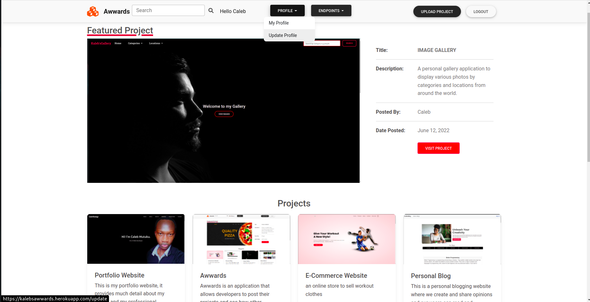

# Awwards

## Description

Awwards is an application which allows developers to post their projects and see how other developers rate them.
## Author

[CalebKabaya](https://github.com/CalebKabaya/)


## Screenshots

```
Landing Page
```



## Features


As a user of the application you will be able to:

1. See all posted projects
2. See each project's description, image, date submitted and title.
3. Submit projects
4. Create profile and edit profile
5. Search for a project by title

## BDD
| Behavior            | Input                         | Output                        | 
| ------------------- | ----------------------------- | ----------------------------- |
|Signup to the application | Click on `Signup` | A sign up page appears with a sign up form |
|  Login to the site | Click on `Log in`  | Redirected to the login page with a login form |
|  Search in the search field | Input keywords to be searched then click SEARCH | Search page is loaded and displays with the searched results |
|Submit a post|click on `Submit`| An upload page appears with an upload form containing different fields|
|View profile|click `username` link in the navbar|Redirects to profile page with an option to edit profile|


## Getting started
### Prerequisites
* python3.6
* virtual environment
* pipenv
* django 2.2.7
### Technologies
* BackEnd:
      * Python
      * Django
* FontEnd:
      * HTML
      * CSS
      * JavaScript
      * Bootstrap
* Database
      * PostgreSQL
* Deployment
      * Heroku   


## Installation
### Requirements

* Either a computer,phone,tablet or an Ipad
* An access to the Internet


### Installation
To get the code..

1. Cloning the repository:
  ```bash
  git clone https://github.com/CalebKabaya/Awwards
  ```
2. Move to the folder and install requirements
  ```bash
  cd myapp
  pipenv install <package name>
  ```
3. Running the application

  ```bash
  make
  ```
4. Testing the application
  ```bash
  python3.8 manage.py test
  ```
Open the application on your browser `127.0.0.1:8000`.
### Known bugs
No known bugs

## Contact Information

For any further inquiries or contributions or comments, reach me at 
[CalebKabaya](https://github.com/CalebKabaya/)


### License

[MIT](license)

Copyright (c) 2021
